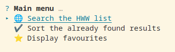
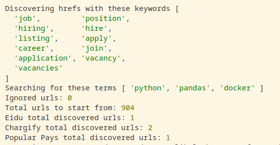
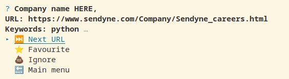

# Interview Search

## Description

This tool need to search in the [hiring-without-whiteboards](https://github.com/poteto/hiring-without-whiteboards) list. It tries to search for the `TECHNOLOGIES_TERMS` in the pages and also looks for hrefs to potential job listings where it searches for the terms again.

The search is case insensitive and it's achieved with puppeteer. It opens a browser so the pages are also displayed while searching.

After the search it aims to create 3 lists:

-   urls containing terms
-   errored urls
-   not matching urls

Eventually these will be filtered into:

-   favourite
-   ignored

## Notes

-   This app is intended for me to sift thru the list in an easy manner and am happy if I find a few automated job openings along the way!

-   The app and methodology is clearly not bulletproof and I am sure a lot of results are not found.

-   There's so much room to improve the app, like scraping in parallel for instance, add stats, etc. For now that's not a priority for me but PRs are welcomed!

-   After search the app will create a `db.json` file. If you want to start fresh just delete the file and restart the app.

-   If you use the app and it helps you, please leave a comment, improve the app, star the repo. Do something to show you like it!

## Features

-   simple cli interface
-   random search in list
-   exclude urls previously visited
-   resume search
-   filter the lists
-   display the final favourite list


## Screenshots





## Usage

1. Create a `.env` file in the root folder.
2. Add:
    * `TECHNOLOGIES_TERMS` - comma separated list of the technologies/terms you want to search for
    * `HREF_DISCOVER` - list of terms in the buttons or links that might reveal job openings. What's already here should pe pretty good
    * `HWW_LIST` - the url for the hiring-without-whiteboards list

3. `.env` file should look like this:

```
    TECHNOLOGIES_TERMS=python, docker, java
    HREF_DISCOVER=job, position, hiring, hire, listing, apply, career, join, application, vacancy, vacancies
    HWW_LIST='https://raw.githubusercontent.com/poteto/hiring-without-whiteboards/master/README.md'
```

4. run `npm install`
5. run `npm start`

## TODO

-   Exit app function :D
-   Refine the user experience a bit

